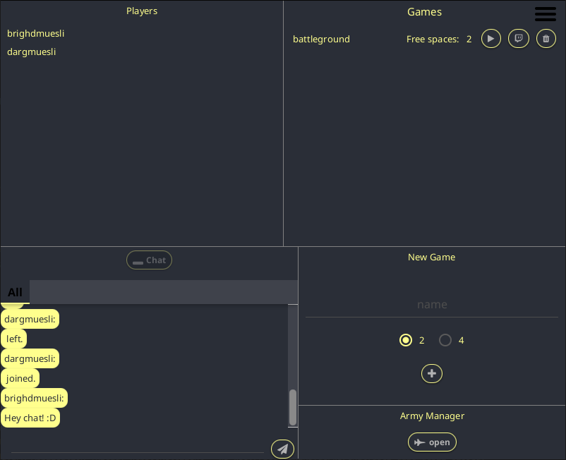

# RBSG - Team B

RBSG is a role-based stategy game by team B of summer semester 2019's module [software engineering](https://seblog.cs.uni-kassel.de/) (SE) at [UniKasselVersität](https://www.uni-kassel.de/uni/).

## Table of Contents

- **[Documentation](#documentation)**
- **[Features](#features)**
- **[Screenshots](#screenshots)**
- **[Note](#note)**

## Documentation

Find this project's Javadoc on [sekassel.github.io](https://sekassel.github.io/SE1SS19TeamB/).

The game server's documentation can be found on [seblog.cs.uni-kassel.de](https://seblog.cs.uni-kassel.de/wp-content/uploads/2019/07/ServerdokuR4.pdf).

## Features

In the following walkthrough, the main features which team B implemented in addition to the basic requirements [1](https://seblog.cs.uni-kassel.de/wp-content/uploads/2019/04/SE1AnforderungenRelease1RBSG.pdf), [2](https://seblog.cs.uni-kassel.de/wp-content/uploads/2019/05/SE1AnforderungenRelease2RBSG.pdf), [3](https://seblog.cs.uni-kassel.de/wp-content/uploads/2019/06/SE1AnforderungenRelease3RBSG.pdf), [4](https://seblog.cs.uni-kassel.de/wp-content/uploads/2019/07/SE1AnforderungenRelease4RBSG.pdf) are **highlighted**.

### Login

After registration on a screen, that looks similar to the one shown in the screenshot below, one can log in and optionally choose to **remember the login credentials**. The button to the top right **toggles fullscreen mode**. The application is **dark-themed** by default, but also includes a white mode.

### Menu

To the top left you can see logged in players that did not yet join a game lobby. Games that can be joined as player or spectator and that can be deleted are listed to the right of them.
The chat is positioned on the bottom left and features **encrypted private chats**. New games can be created on the right with two or four players and one can open the army manager there too.

### Army Manager

You can select all armies that are saved on the game server and create, delete, edit, save, **import and export** them.

### Lobby (spectator)

Below you can see a lobby that was joined in spectator mode. That's why the integrated army manager is not shown. A **bot** was created which is supposed to play by itself when the game will have started. A red or green circle to the right of each user name indicates the **player's readiness**.

### Lobby (player)

Below you can see a lobby that was joined in player mode. On the right you can see the integrated army manager and on the left the chat window. **Joined players, player readiness and minimap** is identical to lobby in spectator mode.

### Ingame

Units are **outlined** with player's color and a **health bar** is shown below. The **textures blend dynamically** eventhough the matchfield is a grid. The possible **paths a unit can move along are displayed** when a unit is selected. The client features an auto-mode which uses AIs to execute the next moves automatically. A minimap can be toggled.

## Note

This project's target was not to create the best game client possible, but rather about learning to develop as a team.
